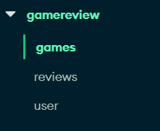

you can check out the live app hosted on heroku here: https://gamereviewcentral-baed019d01e9.herokuapp.com/

This is a game review site where users can add games for review and review other games. Owner of uploaded game can delete other reviews. Built with django and mongoDB Atlas

To run the app locally, here are the following steps:

1. install dependencies:   
    pip install django
    pip install pymongo
    pip install django-heroku

2. create a file named "connectionUrl.py" with the following code:
    ``````
    class URLs:
    mongoURL = 'your-mongodb-atlas-connection-string'
    ``````
    here's how you would set up your db: 

    
  
    everything else should be taken care of!

3. run "python manage.py runserver"! 

Thanks for checking out this project :D